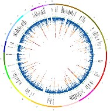
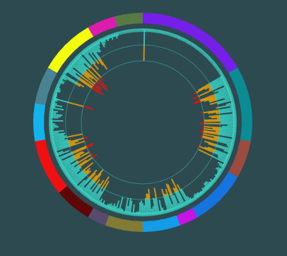

# black-hole-sun

A D3.js library to create a circular historgram with interior series

Based on the [micropolar polar plot library](https://github.com/biovisualize/micropolar).

Inspired by [Nat Genet's work with immune-related loci](https://www.ncbi.nlm.nih.gov/pubmed/24076602).

# Examples

# Code

The best set up is to have an html page where the chart is displayed (e.g. index.htm) which calls a javascript set up file (histogram-start.js):

index.htm

		<!DOCTYPE html>
		<html lang="en">
		  <head>
		    <meta charset="utf-8">
		    <meta http-equiv="X-UA-Compatible" content="IE=edge">
		    <meta name="viewport" content="width=device-width, initial-scale=1">
		    <!-- The above 3 meta tags *must* come first in the head; any other head content must come *after* these tags -->
		    <meta name="description" content="">
		    <meta name="author" content="">
		    
		    <title>Circular Historgram</title>

		    <!-- Polar -->
		    <!-- -->
		     
		    

		  </head>
		  <body bgcolor="#2d4a50">     
		    
      
		          

      
		    
          
		    
		  </body>
		</html>

histogram-start.js

		var configs = [    
		    //r:  Length of BLUE series
		    {
		      dimensions: [                  
		            {label: 'Twitter', startArc: 0, endArc: 60, color: '#761fe8', name: 'Layer1', geometry: 'AreaChart', groupId: 1},
		            {label: 'Malware', startArc: 60, endArc: 100, color: '#0b8b94', name: 'Layer2', geometry: 'AreaChart', groupId: 2},
		            {label: 'Botnets', startArc: 100, endArc: 120, color: '#9d493f', name: 'Layer3', geometry: 'AreaChart', groupId: 3},
		            {label: 'Ransomware', startArc: 120, endArc: 150, color: '#1574e2', name: 'Layer4', geometry: 'AreaChart', groupId: 4},
		            {label: 'OpenSource', startArc: 150, endArc: 160, color: '#c614e4', name: 'Layer5', geometry: 'AreaChart', groupId: 5},
		            {label: 'CI Banking', startArc: 160, endArc: 180, color: '#139de8', name: 'Layer6', geometry: 'AreaChart', groupId: 6},
		            {label: 'CI Power', startArc: 180, endArc: 200, color: '#827b33', name: 'Layer7', geometry: 'AreaChart', groupId: 7},
		            {label: 'CI Comms', startArc: 200, endArc: 210, color: '#594970', name: 'Layer8', geometry: 'AreaChart', groupId: 8},
		            {label: 'CVE', startArc: 210, endArc: 230, color: '#5f0706', name: 'Layer9', geometry: 'AreaChart', groupId: 9},
		            {label: 'DDoS', startArc: 230, endArc: 260, color: '#ef1011', name: 'Layer10', geometry: 'AreaChart', groupId: 10},
		            {label: 'Idenity Theft', startArc: 260, endArc: 280, color: '#13b4eb', name: 'Layer11', geometry: 'AreaChart', groupId: 11},
		            {label: 'CyberCrime', startArc: 280, endArc: 300, color: '#498391', name: 'Layer12', geometry: 'AreaChart', groupId: 12},
		            {label: 'APT', startArc: 300, endArc: 330, color: '#f4ff0d', name: 'Layer13', geometry: 'AreaChart', groupId: 13},
		            {label: 'ShadowBroker', startArc: 330, endArc: 345, color: '#dd1baf', name: 'Layer14', geometry: 'AreaChart', groupId: 14},           
		            {label: 'DoD Cyber', startArc: 345, endArc: 360, color: '#577943', name: 'Layer15', geometry: 'AreaChart', groupId: 15}

		            
		            
		          ],
		      
		      layout: { title: '', width: 400, height: 400, margin: { left: 30, right: 30, top: 00, bottom: 00, pad: 0 }, 
		        font: { family: 'Arial, sans-serif', size: 10, color: '#3ae1d0' },
		        direction: 'clockwise', 
		        orientation: 375, 
		        span: 360,
		        reverseOrder: true,
		        barWidth: 2,
		        radialAxis: { visible: true},
		        barmode: 'stack', backgroundColor: '#3ae1d0', showLegend: false }
		    }            
		];

		configs.forEach(function(_config){
		    var config = {layout: {width: 300, height: 300}};
		    mu.util.deepExtend(config, _config);
		    console.log(JSON.stringify(mu.adapter.plotly().convert(config, true)));
		    var ms =blackholesun.Axis().config(config).render(d3.select('#blackholesun').append('div'));
		    
		    //blackholesun.randomBars();

		    //Create some animation
		    grpChannelCount = [60,40,20,30,10,20,20,210,20,30,20,20,30,15,15]

		    grpLevels = [];
		    for(grp=1; grp<=15; grp++) {
		        maxLevel = Math.random();
		        channelLevel = [];
		        for(channel=1; channel <=grpChannelCount[grp-1]; channel++) {
		            channelLevel.push(maxLevel*Math.random());
		        }
		        grpLevels.push(channelLevel);
		    }

		    function updateGraph(levels) {
		        for(grp = 0; grp< levels.length; grp++) {
		            nextGroup=levels[grp];
		            for(channel=0; channel < nextGroup.length; channel++) {
		                t = nextGroup[channel];
		                blackholesun.updateBar(grp, channel, t);
		            }
		        }

		    }

		    function tweakLevels(levels) {

		        for(grp = 0; grp< levels.length; grp++) {
		            nextGroup=levels[grp];
		            for(channel=0; channel < nextGroup.length; channel++) {
		                old = nextGroup[channel];
		                change=Math.random();
		                if(change > 0.5) {
		                    delta = 0.25-(0.65*Math.random());
		                    newvalue=  old+delta;
		                    if(newvalue <0) newvalue=0;
		                    nextGroup[channel] = newvalue;

		                    blackholesun.updateBar(grp+1, channel, newvalue);
		                }                
		            }
		        }

		    }

		    updateGraph(grpLevels);

		    setInterval(function () {
		        tweakLevels(grpLevels);        
		    }, 1000);

		    

		});

